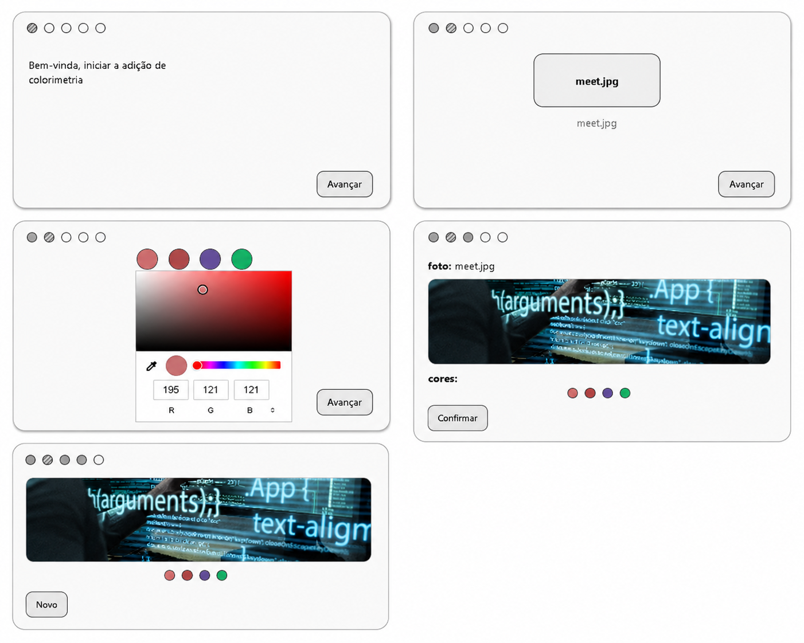

# Desafio de Colorimetria

Este projeto foi desenvolvido durante a aula de Front-end para praticar os conceitos estudados ate o momento.

O desafio simula um pequeno fluxo de atendimento para colorimetria, com navegacao por etapas, upload de imagem e selecao de cores.

## Objetivo

Praticar:

- Estrutura de interface em HTML.
- Estilizacao com CSS.
- Manipulacao de DOM com JavaScript.
- Renderizacao dinamica com innerHTML.
- Controle de estado da aplicacao.
- Eventos de clique e mudanca (click e change).

## Fluxo das telas

O desafio foi construido com 5 etapas:

1. Boas-vindas.
2. Upload da imagem.
3. Escolha de 4 cores.
4. Confirmacao de imagem + cores selecionadas.
5. Tela final com opcao de iniciar um novo fluxo.

## Prints do desafio

## Como funciona (resumo tecnico)

- O estado da aplicacao fica no objeto state (etapa atual, arquivo e cores).
- A funcao getCurrentScreenHtml monta o HTML de cada etapa.
- A funcao render atualiza a tela com base na etapa atual.
- Os eventos sao tratados com event delegation no elemento principal da aplicacao.
- A imagem enviada e exibida com URL.createObjectURL.

## Tecnologias utilizadas

- HTML5
- CSS3
- JavaScript (vanilla)

## Estrutura dos arquivos

- index.html: estrutura base e importacao dos arquivos.
- style.css: layout, responsividade e estilo dos componentes.
- script.js: logica das etapas, renderizacao e interacoes.

## Como executar

1. Abra a pasta do desafio no VS Code.
2. Abra o arquivo index.html no navegador.
3. Siga o fluxo das etapas clicando em Avancar e Confirmar.

## Aprendizados praticados

- Criar interfaces em etapas (step by step).
- Usar condicoes para renderizar telas diferentes.
- Trabalhar com formulario e input file.
- Atualizar interface em tempo real com base no estado.
- Organizar codigo para facilitar manutencao.

## Melhorias futuras

- Adicionar botao de voltar entre etapas.
- Melhorar validacoes de arquivo enviado.
- Extrair cores automaticamente da imagem.
- Salvar historico das selecoes no navegador.
